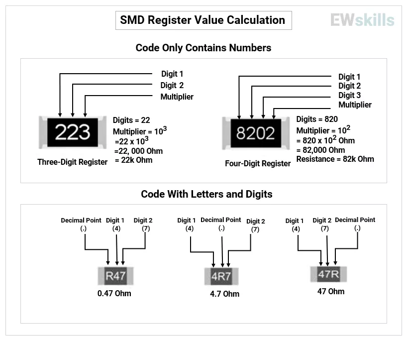

## ❓ Question 1  

**You are inspecting an SMD resistor marked as shown below.**  What is the resistance value of this component?  

  

## ✅ Solution & Learning  

**Correct Option:**  
👉 **1) 10.0Ω**  

**How to Read:**  
- In SMD resistor markings, **“R” acts as a decimal point** for values between 1Ω and 999Ω.  
- Example formats:  
  - `XRY` → R replaces the decimal  
  - `1R0 = 1.0Ω`  
  - `10R0 = 10.0Ω`  
  - `0R22 = 0.22Ω`  

**Applied to this case:**  
- Marking `10R0` = **10.0Ω**  

### 📷 SMD Resistor Calculation Reference:  
  

**Why Important:**  
- Prevents confusion: `4R7` is **4.7Ω**, not 47Ω or 4.7kΩ  
- Misreading can cause:  
  - **Overcurrent**  
  - **Circuit underperformance**  
  - **Component failure**  
- Critical for **sourcing, PCB inspection, and troubleshooting**  

🔗 [Next → Question 2](<../2. Resistor Marking/Question.2.md>)  

---
