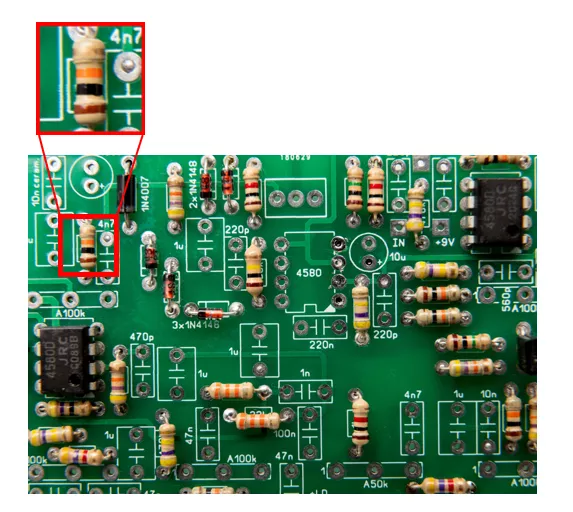
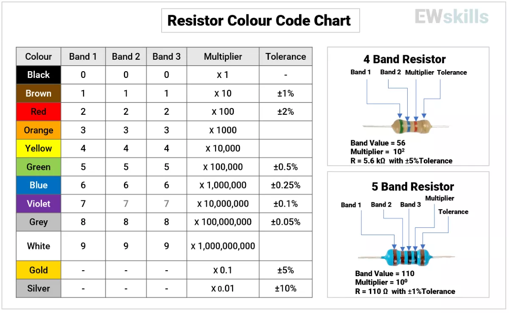

# ❓ Question 4  

**A resistor is mounted on a PCB with the color bands as shown below.** What is the resistance value of this resistor?  

  

---

## ✅ Solution & Learning  

**Correct Option:**  
👉 **2) 10kΩ ±5%**  

---

### 📘 Learning  

A **standard 4-band resistor** follows this format:  
```
[1st Digit] [2nd Digit] × Multiplier ± Tolerance
```
For the given color bands:  
- **Brown** = 1  
- **Black** = 0  
- **Orange** = ×1,000  
- **Gold** = ±5%  

### 📌 Calculation: 
$$
10 \times 1,000 = 10,000Ω = 10kΩ \; (±5\%)
$$  

---

### 📷 Reference Chart:  
  

---

### ⚡ Why This Is Important  

- Reading resistor color codes is a **fundamental electronics skill**.  
- Frequently  encounter **unlabeled resistors** in:  
  - PCBs  
  - Prototyping boards  
  - Debugging & repair work  
- Knowing manual decoding:  
  - Saves time  
  - Helps select replacements without a multimeter  
  - Useful for **BOM verification** & component sourcing  

---
🔗 [← Previous (Q3)](<../2. Resistor Marking/Question.3.md>) | [Restart Quiz](<../2. Resistor Marking/Question.1.md>)  
